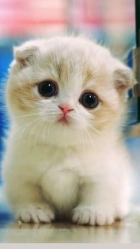

<think>

</think>
<!DOCTYPE html>
<html lang="en">
<head>
    <meta charset="UTF-8">
    <meta name="viewport" content="width=device-width, initial-scale=1.0">
    <title>Valentine's Proposal</title>
    <style>
        body {
            margin: 0;
            padding: 0;
            background: linear-gradient(to bottom, #ffe6f0, #fff8e1); /* Soft pastel pink to light cream */
            font-family: Arial, sans-serif;
            height: 100vh;
            display: flex;
            align-items: center;
            justify-content: center;
            overflow: hidden;
        }
        .container {
            text-align: center;
            position: relative;
        }
        .header {
            font-size: 2.5rem;
            font-weight: bold;
            color: #d63384;
            margin-bottom: 20px;
        }
        .kitten-emoji {
            font-size: 4rem;
            margin: 20px 0;
        }
        .buttons {
            display: flex;
            justify-content: center;
            align-items: center;
            gap: 20px;
            margin-top: 30px;
            padding: 20px;
            background: rgba(255, 255, 255, 0.8);
            border-radius: 15px;
            box-shadow: 0 4px 8px rgba(0, 0, 0, 0.1);
            position: relative;
        }
        button {
            border: none;
            border-radius: 10px;
            padding: 15px 30px;
            font-size: 1.2rem;
            font-weight: bold;
            cursor: pointer;
            transition: all 0.3s ease;
        }
        #yes {
            background: #d63384; /* Dark pink */
            color: white;
            font-size: 1.5rem;
            padding: 20px 40px;
        }
        #no {
            background: #f8d7da; /* Light pink */
            color: #6c757d;
            font-size: 1rem;
            padding: 10px 20px;
            position: relative;
        }
        #after {
            display: none;
            opacity: 0;
            transition: opacity 1s ease-in-out;
            text-align: center;
        }
        #after.show {
            opacity: 1;
        }
        #after p {
            font-size: 2rem;
            color: #d63384;
            margin: 20px 0;
        }
        #after img {
            max-width: 300px;
            border-radius: 15px;
            margin-top: 20px;
        }
        @media (max-width: 600px) {
            .header {
                font-size: 2rem;
            }
            .kitten-emoji {
                font-size: 3rem;
            }
            .buttons {
                flex-direction: column;
                gap: 10px;
            }
            button {
                width: 80%;
            }
        }
    </style>
</head>
<body>
    <div id="initial" class="container">
        <h1 class="header">Will you be my Valentine?</h1>
        <div class="kitten-emoji">🐱</div>
        <div class="buttons">
            <button id="yes">YES</button>
            <button id="no">NO</button>
        </div>
    </div>
    <div id="after" class="container">
        <p>OH WOW!!! CHEEKY 😳💖</p>
        <p>YOU ARE SO BEAUTIFUL</p>
        

    </div>

    <script>
        const yesButton = document.getElementById('yes');
        const noButton = document.getElementById('no');
        const initialDiv = document.getElementById('initial');
        const afterDiv = document.getElementById('after');

        // YES button click event
        yesButton.addEventListener('click', function() {
            initialDiv.style.display = 'none';
            afterDiv.style.display = 'block';
            setTimeout(() => {
                afterDiv.classList.add('show');
            }, 10); // Small delay to trigger transition
        });

        // NO button behavior: Move away on mouseover
        noButton.addEventListener('mouseover', function() {
            const container = document.querySelector('.buttons');
            const containerRect = container.getBoundingClientRect();
            const buttonRect = noButton.getBoundingClientRect();
            
            // Calculate random movement within the container bounds
            let newLeft = Math.random() * (containerRect.width - buttonRect.width);
            let newTop = Math.random() * (containerRect.height - buttonRect.height);
            
            noButton.style.position = 'absolute';
            noButton.style.left = newLeft + 'px';
            noButton.style.top = newTop + 'px';
        });

        // For mobile: Prevent clicking NO by moving it on touchstart
        noButton.addEventListener('touchstart', function() {
            const container = document.querySelector('.buttons');
            const containerRect = container.getBoundingClientRect();
            const buttonRect = noButton.getBoundingClientRect();
            
            let newLeft = Math.random() * (containerRect.width - buttonRect.width);
            let newTop = Math.random() * (containerRect.height - buttonRect.height);
            
            noButton.style.position = 'absolute';
            noButton.style.left = newLeft + 'px';
            noButton.style.top = newTop + 'px';
        });
    </script>
</body>
</html>
```
